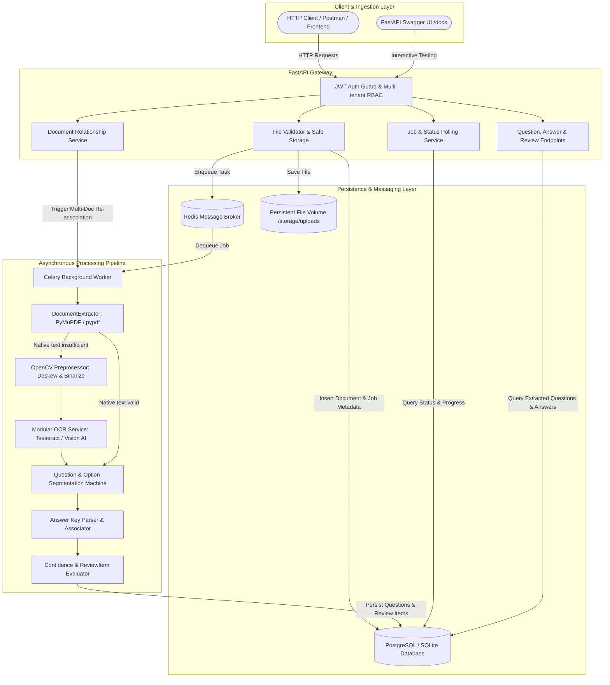
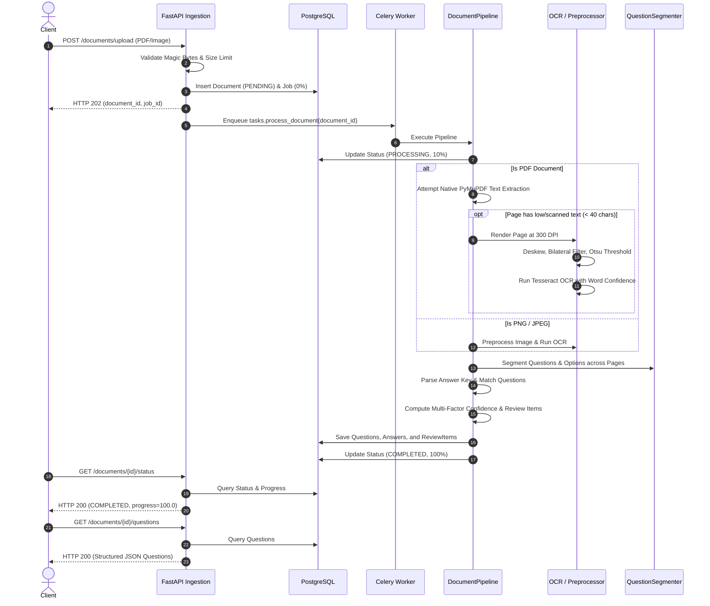
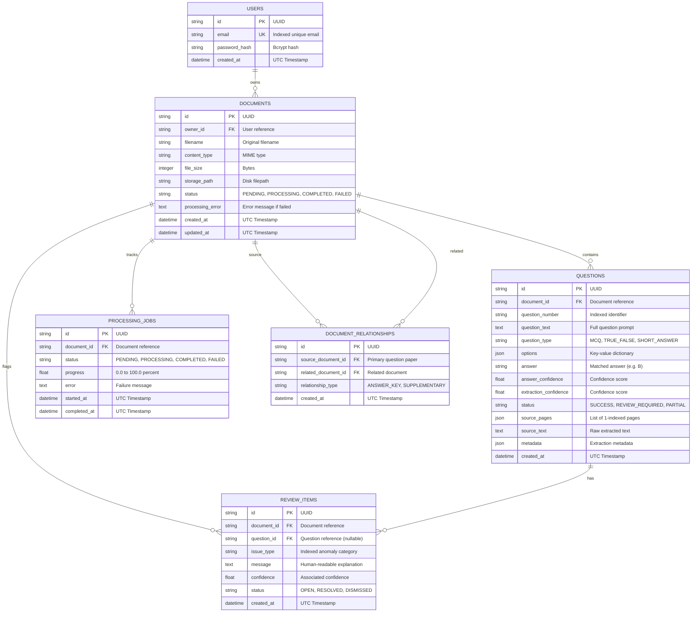

# System Architecture & Technical Design

**Document Intelligence & Question Extraction Service**  
*Pragati Bharati — Round 2 Full Stack Developer Engineering Assignment*

---

## 1. Architectural Overview

The service is designed as an asynchronous, distributed document processing system built around FastAPI, PostgreSQL, Redis, Celery, and a modular document extraction and OCR pipeline.

---

## 2. Component Design

### 2.1 API & Ingestion Layer (`app/api/`, `app/services/`)
- **FastAPI Framework**: High-performance asynchronous ASGI framework with automated OpenAPI schema generation and dependency injection.
- **Asynchronous Non-Blocking Upload**:
  1. Validates MIME type, file extension, file size (max 15MB configurable), and magic byte headers (`%PDF-`, `\x89PNG`, `\xff\xd8\xff`).
  2. Sanitizes filenames against path traversal vulnerabilities.
  3. Writes file to persistent storage with a UUID-prefixed filename.
  4. Creates database records for `Document` and `ProcessingJob`.
  5. Enqueues background worker task and immediately returns `HTTP 202 Accepted` with `document_id` and `job_id`.
- **Status Polling**: `GET /documents/{id}/status` returns current status (`PENDING`, `PROCESSING`, `COMPLETED`, `FAILED`), progress percentage (0-100%), and counts of extracted questions and review items.

### 2.2 Asynchronous Worker & Queue (`app/workers/`, `app/core/celery_app.py`)
- **Celery + Redis**: Industrial-grade task queue ensuring the API remains responsive during large file uploads.
- **Eager Fallback Mode**: When `CELERY_TASK_ALWAYS_EAGER=True` (in local development or automated test runners without an active Redis daemon), tasks execute in-process within the active transaction context, ensuring seamless zero-dependency developer onboarding.

---

## 3. Document Processing & Extraction Engine

### 3.1 PDF Handling & Hybrid OCR Strategy
1. **Native Text First**: Uses PyMuPDF (`pymupdf`) and `pypdf` for fast, lossless digital text extraction per page, preserving 1-indexed page boundaries.
2. **Quality Heuristic**: If a page has fewer than 40 characters or high character entropy, the system identifies it as a scan or image-based page.
3. **High-Resolution Page Rendering**: Renders page to image at 300 DPI via `page.get_pixmap(dpi=300)`.
4. **Image Preprocessing**:
   - Grayscale conversion.
   - Bilateral filtering to denoise background noise while preserving sharp font glyph edges.
   - Skew angle detection via OpenCV `minAreaRect` and affine rotation deskewing.
   - Adaptive binarization (Otsu's thresholding).
5. **OCR Execution**: Runs Tesseract OCR (`--psm 6`) extracting word-level confidence metrics.
6. **Graceful Host Fallback**: If Tesseract is not installed on the host machine, the service catches the condition and falls back gracefully to embedded metadata or structured placeholders without crashing the worker process.

### 3.2 Question & Option Segmentation Machine
- **Numbering Regex Engine**: Detects diverse numbering schemes:
  - Numeric with period: `1. Question`
  - Numeric with parenthesis: `2) Question`
  - Question prefix: `Q1.`, `Q. 1`, `Question 1:`
  - Bracketed / parenthesized: `(1)`, `[1]`
- **Option Extraction**:
  - Alphabetical: `A.`, `B.`, `(A)`, `(b)`, `[A]`
  - Numbered options: `1)`, `2)`, `3)`, `4)`
  - Horizontal/inline options on a single line: `(A) Red  (B) Green  (C) Blue  (D) Yellow`
- **Multi-Page Question Continuity**:
  - Maintains open question state across page transitions.
  - Detects incomplete sentences or option lists continuing from Page $N$ to Page $N+1$.
  - Filters out recurring document header/footer text (e.g. `Part II`, `Page 2 of 4`).
  - Records exact page span: `source_pages=[1, 2]`.
- **Classification Engine**:
  - `MCQ`: Has $\ge 2$ structured options (or 1 partial option flagged for review).
  - `TRUE_FALSE`: Question text or options contain True/False choices.
  - `SHORT_ANSWER`: Open-ended question ending in `?`, `explain`, `define`, or `calculate` with zero options.
  - `UNKNOWN`: Ambiguous structure.

### 3.3 Answer Key Association & Multi-Document Relationships
- **Answer Key Extraction**: Recognizes answer blocks:
  - Header triggers: `Answer Key:`, `Answers:`, `Solution Key:`
  - Patterns: `1-B`, `1. A`, `Q1: C`, `1 (B)`, tabular grids `1 | A`
- **Option Verification**:
  - Matches answer key entry against question's valid option keys (`['A', 'B', 'C', 'D']`).
  - If answer key entry is invalid (e.g. answer key specifies `Z`, but options are only A-D), the system **never silently guesses or invents an answer**. It sets `answer=None`, `answer_confidence=0.35`, and generates a `ReviewItem` of type `LOW_CONFIDENCE_ANSWER`.
- **Multi-Document Relationship Support**:
  - When Question Paper (`Doc A`) and Answer Key (`Doc B`) are uploaded as separate documents:
  - `POST /documents/{doc_a_id}/relationships` with `related_document_id=doc_b_id` and `relationship_type="ANSWER_KEY"`.
  - The pipeline ingests `Doc B`'s answer key text, parses the answers, and automatically associates them into `Doc A`'s questions.

---

## 4. Confidence & Human Review System

### 4.1 Multi-Factor Confidence Scoring Algorithm
The confidence score is computed as a weighted sum of four transparent metrics:

$$\text{Confidence} = w_1 \cdot S_{\text{number}} + w_2 \cdot S_{\text{text}} + w_3 \cdot S_{\text{options}} + w_4 \cdot S_{\text{ocr}}$$

| Component | Weight | Criteria |
| :--- | :--- | :--- |
| **$S_{\text{number}}$ (Question Number)** | 0.20 | 0.20 for clear numeric identifier (`1`, `2`); 0.10 for ambiguous |
| **$S_{\text{text}}$ (Text Completeness)** | 0.25 | 0.25 for text length $\ge 25$ chars; 0.15 for $10-24$ chars; 0.05 for $< 10$ chars |
| **$S_{\text{options}}$ (Option Structure)** | 0.30 | 0.30 for 4 options (A-D); 0.22 for 3 options; 0.15 for 2 options; 0.05 for 1 option |
| **$S_{\text{ocr}}$ (OCR / Page Quality)** | 0.25 | $0.25 \times \text{Avg}(\text{Page OCR Confidence})$ (1.0 for native digital text) |

### 4.2 Quality Tiers & Status Mapping
- **HIGH** ($\ge 0.90$): Complete question, all 4 options, clean text $\rightarrow$ `status="SUCCESS"`
- **MEDIUM** ($0.70 - 0.89$): Valid question with minor non-critical warnings $\rightarrow$ `status="SUCCESS"` or `status="PARTIAL"`
- **LOW** ($< 0.70$): Missing options, degraded scan, or malformed structure $\rightarrow$ `status="REVIEW_REQUIRED"`

### 4.3 ReviewItem Issue Types
Whenever an extraction anomaly is detected, a persistent `ReviewItem` record is created:
1. `LOW_EXTRACTION_CONFIDENCE`: Extraction confidence falls below 0.70.
2. `LOW_CONFIDENCE_ANSWER`: Answer key entry is missing, ambiguous, or failed validation.
3. `MALFORMED_OPTIONS`: Question has fewer than standard options (e.g. 1 option or missing options).
4. `MULTI_PAGE_SPAN`: Question spans across multiple pages (flagged for human verification).
5. `OCR_UNCERTAINTY`: Question extracted from a scanned page with low character fidelity ($< 0.75$).
6. `NO_QUESTIONS_FOUND`: Document processed but no questions could be parsed.
7. `PROCESSING_ERROR`: Document processing encountered a fatal parsing or file error.

---

## 5. Database Schema & ER Diagram

---

## 6. Security Architecture

1. **Authentication**: Stateless JWT access tokens signed with HMAC-SHA256 (`HS256`).
2. **Password Security**: Passwords hashed using standard `bcrypt` with automatic salting.
3. **Multi-Tenant Isolation**: Every database query on documents, questions, answers, and relationships is strictly filtered by the authenticated user's `owner_id`. Any attempt by User B to access User A's document returns `HTTP 403 Forbidden`.
4. **File Upload Hardening**:
   - Magic byte header inspection validates genuine file types, preventing executable or disguised file uploads.
   - Content-type validation against allowed whitelist (`application/pdf`, `image/png`, `image/jpeg`).
   - File size limits enforced (default 15MB).
   - Filename sanitization strips directory traversal sequences (`../`).
   - Storage isolation: files are written to dedicated storage paths using non-predictable UUID keys outside application source code.
5. **Credential Protection**: No secrets or API keys are committed to Git. All configurations are loaded via environment variables using Pydantic Settings.

---

## 7. Scalability & Concurrency Considerations

1. **Horizontal Worker Scaling**: Celery workers can be horizontally scaled across multiple nodes simply by adjusting the replica count (`docker compose up --scale worker=4`).
2. **Stateless API**: FastAPI application instances are completely stateless, allowing them to sit behind load balancers (such as Nginx, AWS ALB, or Traefik).
3. **Shared Storage Volume**: In multi-node deployments, `storage/uploads` can be backed by AWS S3, Google Cloud Storage, or an NFS mount.
4. **Database Connection Pooling**: SQLAlchemy uses connection pooling (`pool_size=20`, `max_overflow=10`, `pool_pre_ping=True`) to handle concurrent database queries efficiently.
5. **Database Indexing**: Foreign keys and query fields (`owner_id`, `document_id`, `status`, `question_number`, `issue_type`) are indexed for fast lookup even with millions of rows.

---

## 8. Trade-offs & Engineering Decisions

1. **Native Text Extraction vs. Full OCR**:
   - *Decision*: Attempt native PDF text extraction first with fallback to image rendering and OCR only when text density is low ($< 40$ chars).
   - *Trade-off*: Reduces document processing time by over 90% for standard digital PDFs while maintaining full fidelity for scanned documents.
2. **PyMuPDF vs. Poppler**:
   - *Decision*: Selected PyMuPDF (`fitz`) for PDF rendering.
   - *Trade-off*: Eliminates external binary dependencies like `pdftoppm` / `poppler-utils` on developer machines while supporting native high-resolution pixmap generation.
3. **Deterministic Parsing vs. External LLMs**:
   - *Decision*: Core extraction is built on deterministic regular expressions and a structural state machine, with a pluggable modular abstraction (`BaseOCRService`) for optional AI vision models.
   - *Trade-off*: Zero external API costs, deterministic reproducibility in automated tests, low latency, and zero data leakage to third-party AI APIs by default.
